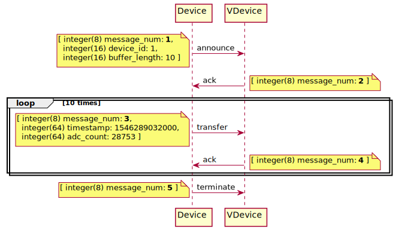
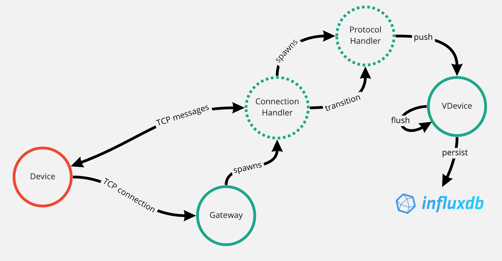

# Biot

Biot (Beam IoT) is a simplified ingestion platform for sensor data. It was built to help demonstrate the benefits of Erlang for IoT, in a presentation to a local meetup (https://www.thingsconnected.net/bournemouth-iot-challenge/).

Biot has the following featues:
- a custom communications protocol, delivered via TCP, between device and platform (the protocol is rather inefficient, sending 1 sample per TCP message). 
- new TCP connections are always accepted.
- device communicates as quickly as possible, platform throttles rate of communication.
- device transfers data in raw ADC (analogue to digital converter) counts, platform performs calibration.
- virtual devices are isolated from one another.

## Protocol sequence diagram

## OTP design

